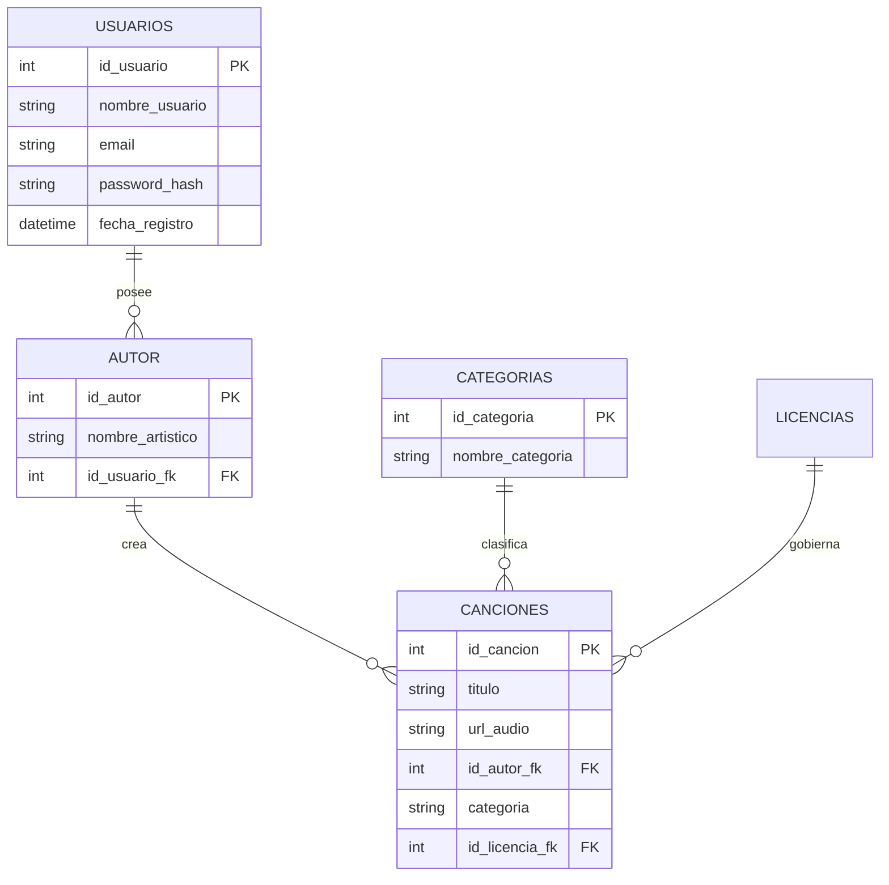

# SONORA


**Sonora** es una aplicación web de alto rendimiento, accesible y de nivel profesional diseñada para la gestión, reproducción y compartición de recursos sonoros de alta calidad. Este proyecto sirve como un caso de estudio definitivo en el desarrollo web moderno, combinando un frontend reactivo con una arquitectura de backend segura y escalable.

---

## 💎 Esencia del Proyecto

Diseñado para el currículo de **DAW (Desarrollo de Aplicaciones Web)**, Sonora trasciende un simple proyecto académico al implementar patrones estándares de la industria:

- **Accesibilidad Universal**: Soporte nativo para tecnologías de asistencia (Lector de pantalla, navegación por teclado).
- **Seguridad Primero**: Hashing de contraseñas, autenticación JWT y prevención de inyección SQL.
- **UX Moderna**: Una estética premium "Sunset Dark" con transiciones fluidas y diseño responsivo.

---

## 🛠️ Inmersión Técnica

### 🅰️ Frontend: Reactivo y Basado en Componentes

Construido con **Angular 16.2.0**, el frontend aprovecha el poder de la programación reactiva y la modularidad.

- **Integración de RxJS**: Filtrado de categorías en tiempo real y optimización de búsqueda mediante Observables.
- **Formularios Reactivos**: Lógica de validación sofisticada en los módulos de Login, Registro y Subida.
- **Arquitectura Modular SCSS**: Un sistema de diseño personalizado construido con variables, mixins (para breakpoints) y convenciones de nomenclatura inspiradas en BEM.
- **SEO y Social**: Etiquetas de título y meta descripciones optimizadas para visibilidad en buscadores.

### 🚀 Backend: Pasarela API Robusta

El backend en **Node.js** utiliza **Express 5.2.1** y **TypeScript** para proporcionar una API RESTful sólida como una roca.

- **Patrón MVC**: Clara separación de responsabilidades entre Rutas, Controladores y Servicios.
- **Middleware Multer**: Gestión de almacenamiento físico de archivos para formatos MP3, MP4 y WAV.
- **Bcrypt y JWT**: Flujo de autenticación estándar de la industria para recursos protegidos.

---

## 📊 Arquitectura de la Base de Datos

El proyecto utiliza una base de datos relacional **MySQL 8.0** estructurada, diseñada para garantizar la integridad de los datos y una recuperación rápida mediante indexación optimizada.



### Entidades Clave

| Tabla        | Descripción                                                                               |
| :----------- | :---------------------------------------------------------------------------------------- |
| `usuarios`   | Identidad central del usuario, credenciales y seguimiento de sesión.                      |
| `autor`      | Perfiles artísticos extendidos vinculados a usuarios registrados.                         |
| `canciones`  | Metadatos para archivos de sonido, incluyendo conteo de vistas y rutas de almacenamiento. |
| `categorias` | Sistema de clasificación dinámica (Naturaleza, Música, SFX, etc.).                        |

---

## ♿ Auditoría de Accesibilidad (Paridad WCAG 2.1)

La accesibilidad no es una característica en Sonora; **es parte de los cimientos.**

- **Landmarks Semánticos**: Uso de `<header>`, `<main>`, `<nav>` y `<footer>` para contexto de navegación inmediata.
- **ARIA y Roles**: Etiquetas explícitas de `role="progressbar"`, `role="alert"` y `aria-label` descriptivas para todos los elementos interactivos.
- **Soporte Visual**: Implementación de utilidades `.visually-hidden` para proporcionar contexto extra a lectores de pantalla sin recargar la interfaz visual.
- **Gestión del Foco**: Un estado `:focus-visible` cuidadosamente personalizado que garantiza un alto contraste e indicación clara para usuarios exclusivos de teclado.

---

## 📂 Estructura del Proyecto

```text
c:/xampp/htdocs/Sonora/
├── 📂 Backend                 # Lógica del Servidor (API REST)
│   ├── 📂 config              # Configuración de BD (db.ts)
│   ├── 📂 controllers         # Lógica de negocio (controladores)
│   │   ├── archivo_controller.ts  # Subida de ficheros con categorías
│   │   ├── audio_controller.ts    # Gestión de canciones y categorías
│   │   └── auth_controller.ts     # Login/Registro
│   ├── 📂 middleware          # Intermediarios (Auth JWT)
│   ├── 📂 routes              # Definición de Endpoints
│   ├── 📂 archivos            # Almacenamiento físico de MP3/MP4
│   ├── sonora.sql             # Script de Base de Datos (Estructura + Datos)
│   └── server.ts              # Punto de entrada (Entry Point)
│
├── 📂 Frontend                # Aplicación Cliente (SPA)
│   ├── 📂 src
│   │   ├── 📂 app
│   │   │   ├── 📂 core        # Servicios Singleton
│   │   │   │   ├── 📂 services
│   │   │   │   │   ├── auth.service.ts  # Cliente HTTP Auth
│   │   │   │   │   └── sound.service.ts # Cliente HTTP Audio y Categorías
│   │   │   ├── 📂 features    # Módulos Funcionales
│   │   │   │   ├── 📂 auth    # Vistas de Auth (Login/Register)
│   │   │   │   ├── 📂 home    # Página principal con categorías dinámicas
│   │   │   │   ├── 📂 category # Vista de detalle por categoría
│   │   │   │   └── 📂 projects # Subida de archivos (Upload)
│   │   │   ├── 📂 layout      # Estructura Base (Header/Footer)
│   │   │   └── 📂 shared      # Componentes Reutilizables
│   │   ├── 📂 styles          # Arquitectura SCSS (Variables, Mixins)
│   │   │   ├── _variables.scss
│   │   │   └── styles.scss    # Estilo Global
│   └── angular.json           # Configuración del CLI
```

---

## ⚡ Despliegue e Inicio Rápido

### Requisitos de Infraestructura

- **Node.js** (v20+)
- **XAMPP / MySQL**
- **Angular CLI** (`npm install -g @angular/cli`)

### 1. Configuración de Base de Datos

1. Abre XAMPP e inicia **MySQL**.
2. Crea una base de datos llamada `sonora`.
3. Importa `Backend/sonora.sql` en la nueva base de datos.

### 2. Ignición del Backend

```bash
cd Backend
npm install
npx ts-node server.ts
```

Tambien hay que importar la bd llamada sonora.sql sino no caragras los sonidos <3

### 3. Lanzamiento del Frontend

```bash
cd Frontend
npm install
ng serve --open
```

---

## 👥 Equipo de Desarrollo

Este proyecto fue desarrollado por estudiantes del módulo **2º DAW - Diseño de Interfaces Web (DIW)**.  
Construido con pasión por el código de calidad y el diseño universal.---

© 2026 Sonora Project - Construyendo una web para todos.
